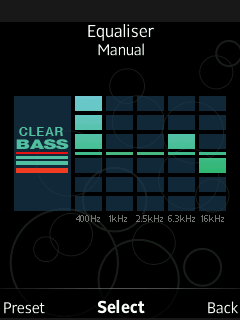
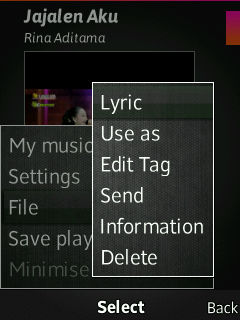

# A2 Walkman Skinner
Change layout of MusicApplication GUI

## Features
- Ability to select skin
- Ability to edit skin
    - Ability to hide/show of each items.
    - Ability to change coordinates of each item.
    - Ability to choose Text color, Font size, Font style, etc of each item.
    - Ability to set Cover Art size on display
- Ability to show Lyrics (lrc file) when music playing.
- Ability to edit music tag using [mtagger.elf](#mtagger-path) or [TagEditor.elf](#tageditor-path).
- Ability to jump into specific time on current track (DB32XX only).  
- Ability to set current track as:
    - Ringtone
    - SMS Alert
    - Alarm Signal
    - Contacts ringtone
- Ability to set button keys into softKeys shortcut.
- Ability to auto turn off MusicApplication on specific time.
- Change Equalizer GUI into Clearbass(style) GUI for non-Clearaudio phones.

## Devices
- **C510 R1HA035**
- **C702 R3EF001**
- **C901 R1GA028**
- **G502 R1FA037**
- **K630 R1FA032**
- **W508 R1FA035**
- **W595 R3EF001**
- **W705 R1GA031**
- **W715 R1GA030**
- **W760 R3EM001**
- **W890 R1FA035**
- **W902 R3EG004**
- **W910 R1FA037**
- **W980 R3EG004**
- **W995 R1HA035**
- ...

## Patch Info
```
;A2 Walkman skinner
;Adds possibility to edit the Position,Color,Font
;Enable/Disable Title,Artist,Album,Genre,Total/Elapsed/Remaining time,Extension,Bit-rate,Total/Current track number,progress-bar,Album art
;Adds new items of Genre,Extension,Bit-rate,Overlay image to Walkman
;Adds possibility to edit position of icons shuffle/EQ/loop/state/wheel,Title/Artist/Album/Background/Overlay image
;Adds possibility to use skins in Walkman Player
;Adds skin editor for easy loading & editing of skins
;Redraws everything in Walkman(Nowplaying, TimeInput,ColorInput,FontSelect),optimized for better Walkman experience
;Ability to show Lyrics (lrc file) when music playing.
;Ability to edit music tag (using `mtagger.elf` or `TagEditor.elf`).
;- /usb/other/ZBin/mtagger.elf
;- /usb/other/ZBin/mtagger.elf
;- /card/other/ZBin/mtagger.elf
;- /card/other/ZBin/TagEditor.elf
;Ability to jump into specific time on current track (DB32XX only).  
;Ability to set current track as:
;- Ringtone
;- SMS Alert
;- Alarm Signal
;- Contacts ringtone
;Ability to set button keys into softKeys shortcut
;Ability to auto turn off MusicApplication on specific time.
;Change Equalizer GUI into Clearbass(style) GUI for non-Clearaudio phones.
;(c) Blacklizard, D3Mon, farid
;(r) Kren
```

## Path
### Skins
```
/usb/other/ZBin/Config/WALKMAN
```
### Equalizer
```
/usb/other/ZBin/Config/Equalizer
```
### Structure:
```
/usb/other/ZBin/Config/WALKMAN/
├── ..
├── SkinName/
│   └── *.png
├── SkinName.wsk
├── CurrentSkin
└── ...

/usb/other/ZBin/Config/Equalizer/
└── *.png
```
### MTagger
<details>

#### Internal
```
/usb/other/ZBin/mtagger.elf
```
#### External
```
/card/other/ZBin/mtagger.elf
```
</details>

### TagEditor
<details>

#### Internal
```
/usb/other/ZBin/TagEditor.elf
```
#### External
```
/card/other/ZBin/TagEditor.elf
```
</details>

## Skins
### Skin Images:
<details>

```
MP_BG_LD.png
MP_BG_PT.png
NO_COVER_ICN.png
OVERLAY_IMAGE_P.png
BLOB.png
MP_EQ_STATUS_ICN.png
MP_MODE_LOOP_ICN.png
MP_MODE_RANDOM_ICN.png
MP_PAUSE_ICN.png
MP_PLAY_ICN.png
MP_REWIND_ICN.png
MP_FAST_FORWARD_ICN.png
MP_ALBUM_ICN.png
MP_ARTIST_ICN.png
MP_TRACK_ICN.png
MC_WHEEL_BACKGROUND_ICN.png
MC_WHEEL_DOWN_ICN.png
MC_WHEEL_FF_ICN.png
MC_WHEEL_NEXT_ICN.png
MC_WHEEL_PAUSE_ICN.png
MC_WHEEL_PLAY_ICN.png
MC_WHEEL_PREV_ICN.png
MC_WHEEL_REW_ICN.png
MC_WHEEL_UP_ICN.png
OVERLAY_IMAGE_L.png
REFLECT.png
MP_EQ_BASS_ICN.png
MP_EQ_MANUAL_ICN.png
MP_EQ_MEGABASS_ICN.png
MP_EQ_NORMAL_ICN.png
MP_EQ_TREBLEBOOST_ICN.png
MP_EQ_VOICE_ICN.png
PROGRESSBAR_OVERLAY.png
PROGRESSBAR_OVERLAY_LANDSCAPE.png
MP_MODE_REPEAT_ONE_ICN.png
```

</details>

### Equalizer Images:
<details>

```
MP_EQ_TREBLE_H_ICN.png
MP_EQ_HEAVY_H_ICN.png
MP_EQ_POP_H_ICN.png
MP_EQ_JAZZ_H_ICN.png
MP_EQ_NORMAL_H_ICN.png
MP_EQ_UNIQUE_H_ICN.png
MP_EQ_SOUL_H_ICN.png
MP_EQ_LIGHT_H_ICN.png
MP_EQ_BASS_H_ICN.png
BOOST_LEVEL1.png0
BOOST_LEVEL2.png1
BOOST_LEVEL3.png2
BOOST_LEVEL4.png
BAR_MINUS3.png0
BAR_MINUS2.png1
BAR_MINUS1.png2
BAR_NORMAL.png3
BAR_PLUS1.png
BAR_PLUS2.png
BAR_PLUS3.png
```
</details>

## Management Key:
### Now playing
- **0** - **9** : Configurable at `Settings->Shortcuts`
- **#** (*short press*): Minimize MusicApplication
- **#** (*long press*): Close MusicApplication
- **Star** : KeyLock

### Lyric GUI
- **2** / **8** : volume Up/Down
- **4** / **6** (*short press*) : Prev / Next track
- **4** / **6** (*long press*) : FasrForward / Rewind current track
- **5** : Centering lyric text
- **0** : Show/Hide inactive text
- **Enter** : Play/Pause player

### EditCoordinates GUI
- **2** / **UP** : Move Up cursor
- **8** / **DOWN** : Move Down cursor
- **4** / **LEFT** Move Left cursor
- **6** / **RIGHT** Move Right cursor
- **RightSoftkeys** : Change orientation
- **End** : Cancel editing
- **Enter** : OK

## Other
### Lyric
Put lrc file on the same folder with audio file.  
Example:
```
/usb/music/my_song.mp3
/usb/music/my_song.lrc
/card/music/my_song2.m4a
/card/music/my_song2.lrc
```

#### Supported LRC encoding
* ANSI
* UTF8 BOM
* UTF16 LE
* UTF16 BE

## Screenshot
### Now Playing


### Skin Select


### Skin Editor


### Equalizer (non-clearaudio)



### Goto


### Self Timer


### Lyric



### Use As


### Select Shortcut


## [Go Back](/readme.md)