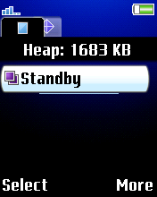
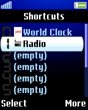
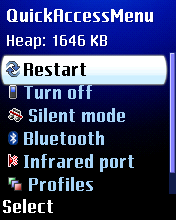

# AdvButton
Remap button function to advanced function.  

## Features
1. BookManager[^1]
    - 1st tab: Manage running books with GUI
    - 2nd tab: Manage running ELF 
    - Ability to rename books
    - Ability to set/edit/remove custom shortcut on button `0` to `9` (works on 1st tab + short press only)
    - Available shortcut: Menu amd Java apps.
2. QuickAccess Menu
    - Display on off menu like on newer phone
    - Add option to restart phone
3. Switch Book
    - Switch back and forth of running books, like Windows `Alt+Tab` function
4. Screenshooter
    - Take screenshot of main display `=)`

[^1]: (c) Hussein

## Devices
- **K600 R2BB001**[^1.2.4]
- **K750 R1CA021**[^1.2.4]
- **W200 R4HA014**[^1.2.4]
- **W700 R1CA021**[^1.2.4]
- **W800 R1BD001**[^1.2.4]
- **W900 R5BC004**[^1.2.4]
- **Z520 R3J017**[^1.2.4]
- ...

## Patch Info
```
;Remap button function to advanced function. 
;- BookManager
;- QuickAccess Menu
;- Switch Book
;- Screenshooter
;(c) farid
```

## Key Management:

### **OLD A1**
- `Power` : Open QuickAccess menu

### **K600 R2BB001**
- `Task` : Open BookManager
- `VideoCall` : Take screenshot and save it as `PNG`

### **K750 R1CA021**
- `Task` : Open BookManager
- `Play` : Switch to previous book (like on Windows `Alt+Tab`)

### W200 R4HA014
- `MediaPlayer` : Open BookManager

### **W700 R1CA021 && W800 R1BD001**
- `MediaPlayer` : Open BookManager
- `CameraShot` : Take screenshot and save it as `PNG`

### **W900 R5BC004**
- `Internet` : Open BookManager
- `VideoCall` : Take screenshot and save it as `PNG`

### **Z520 R3J017**
- `Operator` : Open BookManager
- `Camera` : Take screenshot and save it as `PNG`

## How to use
### BookManager
After installing patch, put `booknames.ini` and `shortcut.ini` into `%INI_DIR%`

### Keys:
- `*` : Close all books and goto Standby
- `#` : Minimize all books and goto Standby
- `c` : Kill selected Book / Elf

### booknames.ini 
<details>

Format:
```
OriginalBookName: NewBookName
```
Example:
```
StandbyBook: Standby
Menu_Globals: Main Menu
MM_BrowserToplevelBook: Media Browser
AudioPlayerBook: Audio Player
```

</details>

### shortcut.ini
<details>

Format:
```
[KEY_%d]: java:java_name//hash_value 
[KEY_%d]: Shortcut_Name_Id
```
Example:
```
[KEY_0]: java:World Clock//jae949440276bbd6a1c458f1f839a6d8fd1adc966
[KEY_1]: FMRadio
```

</details>

## TODO
*Port to DB2020 phones*

## libpng License
`AdvButton` use `libpng`. For the full libpng license, see [libpng.org](http://www.libpng.org/pub/png/libpng.html).

[^1.2.4]: [*libpng 1.2.4*](https://sourceforge.net/projects/libpng/files/libpng12/older-releases/1.2.4/)

## Screenshot







## [Go Back](../readme.md)