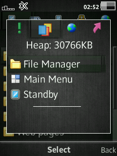
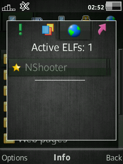

# BookManager Mod
Improved activity menu.

## Features
- Corrected 1st tab title to "New Events: %d"
- Change 2nd tab to BookManager to manage running books.
- Change 3rd tab to ElfManager to manage running Elfs
- Change 4th tab to MyShortcut
    - Shutdown
    - Restart
    - Brightness
    - Flight mode
    - Close connection
- Ability to set custom name and icon for each book.

## Devices
- **C510 R1HA035**
- **G502 R1FA037**
- **J105 R1GA026 Orange**
- **J105 R1HA035**
- **K630 R1FA032**
- **T707 R1FA035**
- **W508 R1FA035**
- **W595 R3EF001**
- **W715 R1GA030**
- **W760 R3EM001**
- **W810 R4EA031**
- **W902 R3EG004**
- **W910 R1FA037**
- **W980 R3EG004**
- **W995 R1HA035**
- ...

## Config
### path
```
/usb/other/ini/bookman.ini
```
### example
```
StandbyBook: Standby
BookanagerBook: Book Manager
ICON: MENU_DISPLAY_TAB_INACTIVE_ICN

MenuBook: Main Menu
ICON: JOYSTICK_DESKTOP_MENU_ICN

OngoingCallBook: Calling
ICON: HANDSET_ICN
```

## Patch Info
```
;Improved Activity Menu
;1st tab corrected for the title "New Events: %d"
;2nd tab displays running books GUI + header "Heap: %dKB"
;3rd tab displays running elf + in the title count of the elves in the memory
;4th tab: shut down, restart, brightness, flight mode, close the connection
;Support for custom names of the books, on file bookman.ini (/usb/other/ini/bookman.ini)
;Hotkeys:
; `*` : Close all books and goto Standby
; `#` : Minimize all books and goto Standby
; `c` : Kill selected Book / Elf
;(c) E1kolyan
;(r) IronMaster, den_po
;(e) farid
```

## Management Keys
- `*` : Close all books and goto Standby
- `#` : Minimize all books and goto Standby
- `c` : Kill selected Book / Elf

## Screenshot





## [Go Back](../readme.md)