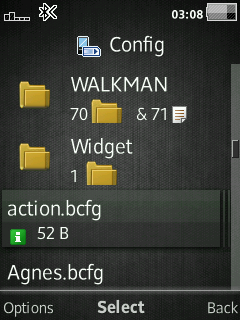
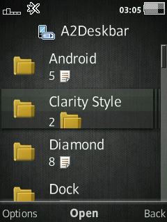
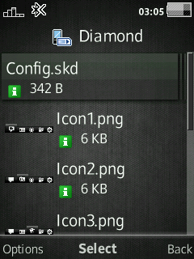

# DBItemText
Display more info of file or folder on FileManager when view mode set to Thumbnail List

## File
Display file size on second line of list item.  
Display in B, KB, MB based on filesize.  
Display file permission.  

## Folder
Display count of files and/or sub-folder inside it.

## Devices
- **C510 R1HA035**
- **G502 R1FA037**
- **W715 R1GA030**
- **W995 R1HA035**
- ...

## Patch Info
```
;Display more info of file or folder on FileManager when view mode set to Thumbnail List
;File: Show file size on second line of list item.
;Folder: Show count of files and/or sub-folder inside it on second line of list item.
;(c) farid
```

## Screenshot




## [Go Back](../readme.md)