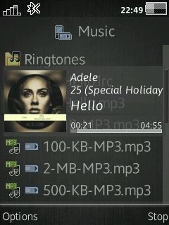
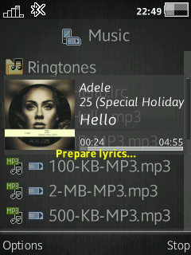
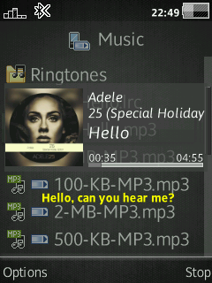
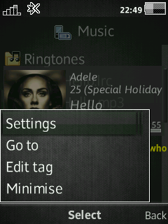
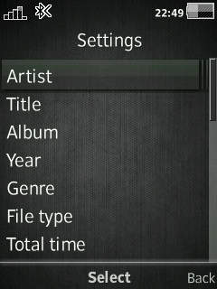
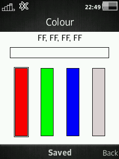
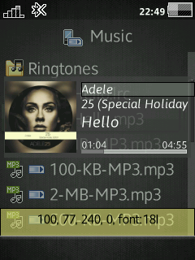
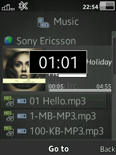

# DB Player A2
Add advanced display information when playing music on File Manager

## Features
- Display album cover
- Display progress bar, slider and stroke
- Select progress bar type: normal and rounded ends
- Display time: full, current, remaining
- Display tags: artist, album, title, year, genre
- Display information: bit rate, sampling frequency, audio output, format type
- Display icons: background, frame
- Display current time progressbar
- Display volume state progressbar
- Setting activity, color, etc.
- Setting coordinates and font in real time
- Ability to use color for background
- Enable/disable window appearance animation
- Ability to minimize window
- Edit tags in Music Tagger
- Ability to show/hide status bar
- Ability to show/hide softkeys
- Auto close window
- Auto update settings
- Go to specified time
- Display Lyric of playing audio

## Devices
- **C510 R1HA035**
- **C901 R1GA028**
- **C903 R1GA028**
- **C905 R1FA035**
- **G502 R1FA037**
- **J105 R1GA026 Orange**
- **J105 R1HA035**
- **U10 R7AA071**
- **U100 R7AA076**
- **W508 R1FA035**
- **W595 R3EF001**
- **W715 R1GA030**
- **W902 R3EG004**
- **W910 R1FA037**
- **W980 R3EG004**
- **W995 R1HA035**
- ...

## Patch Info
```
;Add advanced display information when playing music on File Manager
; - Display album cover
; - Display progress bar, slider and stroke
; - Select progress bar type: normal and rounded ends
; - Display time: full, current, remaining
; - Display tags: artist, album, title, year, genre
; - Display information: bit rate, sampling frequency, audio output, format type
; - Display icons: background, frame
; - Display current time progressbar
; - Display volume state progressbar
; - Setting activity, color, etc.
; - Setting coordinates and font in real time
; - Ability to use color for background
; - Enable/disable window appearance animation
; - Ability to minimize window
; - Edit tags in Music Tagger
; - Ability to show/hide status bar
; - Ability to show/hide softkeys
; - Auto close window
; - Auto update settings
; - Go to specified time
; - Display Lyric of playing audio
; - Pause
; - Controls:
; Joystick up/down - volume
; Joystick left/right - rewind
; # - Mute/restore sound
; * - button lock
;v. 7
;(c) E1kolyan
;(e) farid
```

## Images
### Path
```
/usb/other/ZBin/Config/DBPlayer
```
### Structure:
```
/usb/other/ZBin/Config/DBPlayer/
??? DBPlayer.cfg
??? *.png

```

### Images Name:
<details>

```
BACKGROUND.png
NO_COVER.png
FRAME.png
PLAY_ICN.png
PAUSE_ICN.png
ARTIST_ICN.png
TITLE_ICN.png
ALBUM_ICN.png
SLIDER.png
MUTE_ICN.png
```

</details>

### MTagger
```
/usb/other/ZBin/mtagger.elf
```

## Management Key:

### General
- **UP** / **DOWN** : Volume Up/Down
- **#** : Mute sound
- **Enter** : Play Pause

### NowPlaying tab
- **RIGHT** : Switch to Lyric tab
- **#** (*short press*): Minimize MusicApplication
- **RIGHT** (*long press*): Fast Forward current track
- **LEFT** (*long press*): Rewind current track
- **Star** : KeyLock

### Lyric tab
- **4** (*short press*) : Switch to Player tab
- **5** : Centering lyric text
- **0** : Show/Hide inactive text
- **Star** : Show/Hide lyric text

### Edit mode
- **2** / **8** : move x pos of item
- **4** / **6** : move y pos of item
- **3** : change text overlay
- **Up** / **Down** : change font size
- **Del** : change font style (DB32XX and DB3350 only)
- **5** : Save settings
- **0** : Cancel editing

## Other
### Lyric
Put lrc file on the same folder with audio file.  
Example:
```
/usb/music/my_song.mp3
/usb/music/my_song.lrc
/card/music/my_song2.m4a
/card/music/my_song2.lrc
```

#### Supported LRC encoding
* ANSI
* UTF8 BOM
* UTF16 LE
* UTF16 BE

## Screenshot









## [Go Back](/readme.md)