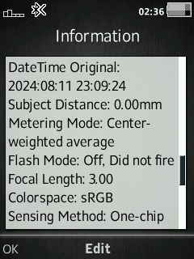

# EXIF Info
Display Exif Info of JPEG files.  
Added 40 Exif Info on JPEG File Information.  
It will display only available tags, the unavailable and not listed tags are skipped.  

## EXIF tags

<details>

1. Camera Make 
2. Camera Model 
3. Orientation
4. X Resolution
5. Y Resolution
6. Resolution Unit
7. Software
8. Modify Date
9. YCbCr Positioning
10. Exposure Time
11. Exposure Program
12. F-Number
13. ISO Speed
14. Copyright
15. Date/Time Original
16. Metering Mode
17. Light Source
18. Flash Mode
19. Exposure Compensation
20. Subject Distance
21. Focal Length
22. Colorspace
23. Sensing Method
24. Custom Rendered
25. Exposure Mode
26. White Balance
27. Digital Zoom
28. Scene Capture Type
29. Contrast
30. Saturation
31. Sharpness
32. Lens Make
33. Lens Model
34. GPS Latitude Ref
35. GPS Latitude
36. GPS Longitude Ref
37. GPS Longitude
38. GPS Altitude
39. GPS Timestamp
40. GPS Satellites

</details>

## Devices
- **C510 R1HA035**

## Patch Info
```
;EXIF Info
;Display Exif Info of JPEG file.  
;Added 40 Exif tags on JPEG file information.  
;1.Camera Make 
;2.Camera Model 
;3.Orientation
;4.X Resolution
;5.Y Resolution
;6.Resolution Unit
;7.Software
;8.Modify Date
;9.YCbCr Positioning
;10.Exposure Time
;11.Exposure Program
;12.F-Number
;13.ISO Speed
;14.Copyright
;15.Date/Time Original
;16.Metering Mode
;17.Light Source
;18.Flash Mode
;19.Exposure Compensation
;20.Subject Distance
;21.Focal Length
;22.Colorspace
;23.Sensing Method
;24.Custom Rendered
;25.Exposure Mode
;26.White Balance
;27.Digital Zoom
;28.Scene Capture Type
;29.Contrast
;30.Saturation
;31.Sharpness
;32.Lens Make
;33.Lens Model
;34.GPS Latitude Ref
;35.GPS Latitude
;36.GPS Longitude Ref
;37.GPS Longitude
;38.GPS Altitude
;39.GPS Timestamp
;40.GPS Satellites
(c) farid
;Original idea from Amir_82111's patch 
```

## Screenshot
 
 
 
 
 
 
 
 
 
 
 
 
 


## nanoexif License
`EXIF Info` use `nanoexif` library. For the full `nanoexif` library license, see [github-repo](http://github.com/tokuhirom/nanoexif).

### [Go Back](../readme.md)