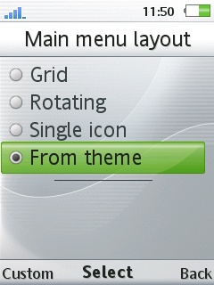
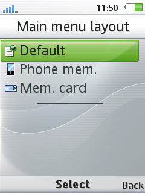
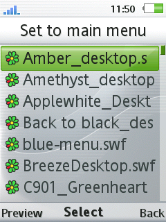
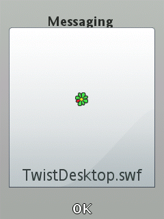

# FlashMenuPicker
Ability to select SWF as Custom Flash Menu.

### Usage
For A1 phones select swf from Main Menu->Layout->FlashMenuPicker.  
For A2 phones select swf from Main Menu Layout->Custom->FlashMenuPicker.  
Put SWF on correct directory.  

### Added 3 options:
1. Default `/tpa/preset/system/desktop/flash`
2. Phone Memory `%PATH_IMAGE_INT%/flash`
3. Memory Card `%PATH_IMAGE_EXT%/flash`

### Devices
- **C510 R1HA035**
- **C902 R3EG004 AO**
- **C903 R1GA028**
- **C905 R1FA035**
- **F100 R1GA026**
- **J20 R7CA064**
- **T707 R1FA035**
- **U10 R7AA071**
- **U100 R7AA076**
- **W550 R4CB020**
- **W595 R3EF001**
- **W715 R1GA030**
- **W760 R3EM001**
- **W810 R4EA031**
- **W900 R5BC004**
- **W902 R3EG004**
- **W910 R1FA037**
- **W980 R3EG004**
- **W995 R1HA035**
- ...

### Patch Info
```
;Ability to select SWF as Custom Flash Menu
;Select swf from Main Menu Layout->Custom->FlashMenuPicker.
;Added ability to preview SWF before set.
;Put SWF on correct directory
;1. Default `/tpa/preset/system/desktop/flash`
;2. Phone Memory `%PATH_IMAGE_INT%/flash`
;3. Memory Card `%PATH_IMAGE_EXT%/flash`
;(c) farid
;Original idea from Myrzeug
```

### Screenshot






## [Go Back](/readme.md)