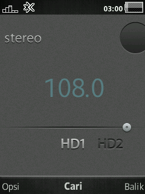
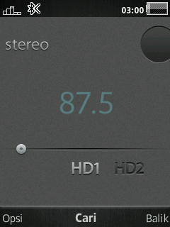
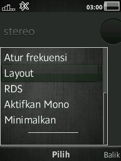
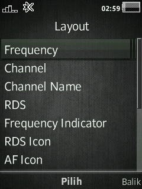

# Fm Radio Layout Editor
Change layout of FmRadio GUI

### Features
- Ability to hide/show all items.
- Ability to change coordinates of each item in realtime.
- Ability to choose Text color, font, etc.
- Ability to use color or Image on the background.

### Devices
- **C510 R1HA035**
- **G502 R1FA037**
- **W508 R1FA035**
- **W580 R8BE001**
- **W715 R1GA030**
- **W810 R4EA031**
- **W902 R3EG004**
- **W910 R1FA037**
- **W980 R3EG004**
- **W995 R1GA026**
- **W995 R1HA035**
- ...

## Patch Info
```
;Fm Radio Layout Editor
;Change layout of FmRadio GUI
;Ability to hide/show all items.
;Ability to change coordinates of each item in realtime.
;Ability to choose Text color, font, etc.
;Ability to use color or Image on the background.
;(c) farid
```

### Path: 
`/usb/other/ZBin/Config/FmRadio`

### Images:
    1. BACKGROUND_ICN.png
    2. RDS_ACTIVE_ICN.png
    3. RDS_INACTIVE_ICN.png
    4. AF_ON_ICN.png
    5. AF_OFF_ICN.png
    6. MONO_ICN.png
    7. STEREO_ICN.png
    8. FREQUENCY_INDICATOR_ICN.png
    9. ARROW_LEFT_IDLE_ICN.png
    10. ARROW_LEFT_MANUAL_ICN.png
    11. ARROW_LEFT_AUTOSEEK_ICN.png
    12. ARROW_RIGHT_IDLE_ICN.png
    13. ARROW_RIGHT_MANUAL_ICN.png
    14. ARROW_RIGHT_AUTOSEEK_ICN.png
    15. ARROW_UP_IDLE_ICN.png
    16. ARROW_UP_ACTIVE_ICN.png
    17. ARROW_DOWN_IDLE_ICN.png
    18. ARROW_DOWN_ACTIVE_ICN.png

### Management Key:
- **2** / **8** : to move up / down
- **4** / **6** : move left / right
- **5** : save changes
- **0** : undo changes
- **C** : change font style (**Bold**, *Italic*, ***Bold Italic***) DB32XX Only
- Navigation **Up** / **Down** : increase / decrease the font size and the frequency indicator
- Navigation **left** / **right** : increase / decrease the width frequency indicator and Text
- OK : Change text overlay

### Screenshot
 
 



## [Go Back](../readme.md)