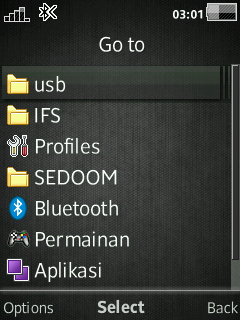
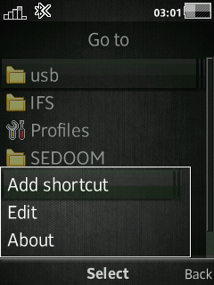
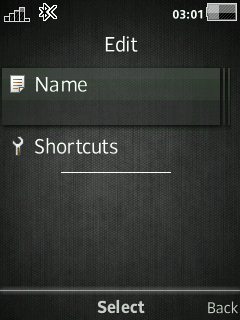
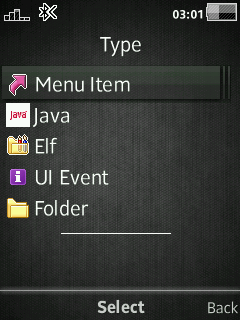
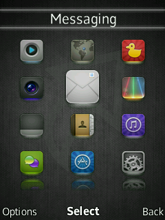
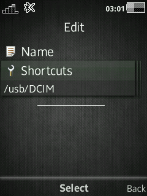

# Goto Shortcuts
Change right or left standby softkeys to Goto Shortcut *like on nokia phones*

## Features
Set shortcut name to your own choice.  
You can choose 5 shortcut type with your own choice.  
- Shortcut
- Java (not implemented yet on all DB3350)
- Elf (no elfloader on DB3350 right now)
- Event
- Folder

## Devices
- **C510 R1HA035**
- **G502 R1FA037**
- **J20 R7CA064**
- **J105 R1HA035**
- **K600 R2BB001**
- **K630 R1FA032**
- **K800 R8BF003**
- **U10 R7AA071**
- **U100 R7AA076**
- **W200 R4HA014**
- **W350 R11CA002**
- **W508 R1FA035**
- **W580 R8BE001**
- **W595 R3EF001**
- **W715 R1GA030**
- **W760 R3EM001**
- **W810 R4EA031**
- **W902 R3EG004**
- **W910 R1FA037**
- **W980 R3EG004**
- **W995 R1HA035**
- ...

## Patch Info
```
;Change Right Softkey in Standby to "Goto" Shortcut
;You can choose 5 shortcut type with your own choice
;- Shortcut
;- Java
;- Elf
;- Event
;- Folder
;+Ability to create, edit, or delete shortcut
;(c) farid
```

## Screenshot









## [Go Back](../readme.md)