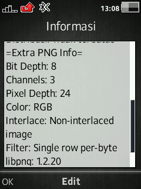
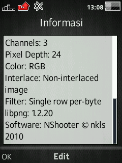
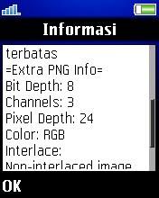
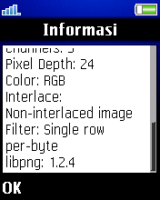
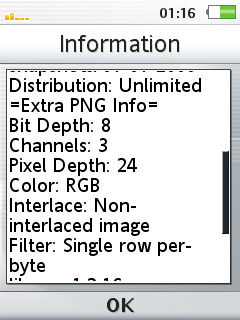
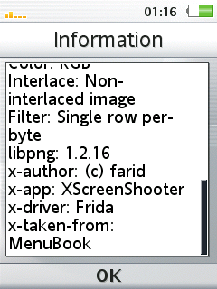

# PNG Info
Add more info about PNG in file information window

### Extra Info
    Bit depth
    Channels
    Pixel Depth
    Color
    Interlace
    Filter
    User Text info

### Devices
- **C510 R1HA035** ([*libpng 1.2.20*](https://sourceforge.net/projects/libpng/files/libpng12/older-releases/1.2.20/))
- **K600 R2BB001** ([*libpng 1.2.4*](https://sourceforge.net/projects/libpng/files/libpng12/older-releases/1.2.4/))
- **U100 R7AA076** ([*libpng 1.2.16*](https://sourceforge.net/projects/libpng/files/libpng12/older-releases/1.2.16/))
- ...

### Patch Info
```
;Add more info about PNG in file information window
;Bit depth
;Channels
;Pixel Depth
;Color
;Interlace
;Filter
;User Text info
;(c) farid
```

### Screenshot
- **C510 R1HA035**

 


- **K600 R2BB001**

 


- **U100 R7AA076**

 


### libpng License
`PNGInfo` use `libpng`. For the full libpng license, see [libpng.org](http://www.libpng.org/pub/png/libpng.html).

## [Go Back](../readme.md)