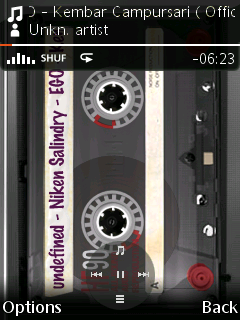
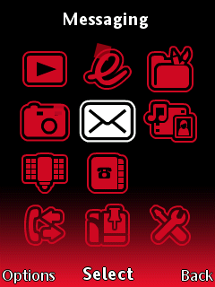
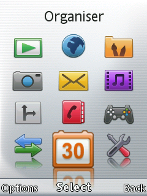
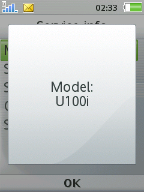

# ScreenShooter
Add ability to take screenshot with button Game A&B

### Usage
- Game A: save screenshot as `PNG`.
- Game B: save screenshot as `BMP`.
- On MusicApplication Game A+B button works as Next and Prev track button.
- BMP and PNG saved on `/usb/picture/snapshots/`

### Devices
- **U100 R7AA076** ([*libpng 1.2.16*](https://sourceforge.net/projects/libpng/files/libpng12/older-releases/1.2.16/))
- ...

### Patch Info
```
;Ability to take screenshot using button Game A&B
;Game A: save screenshot as PNG
;Game B: save screenshot as BMP
;On MusicApplication Game A+B button works as Next and Prev track button
;BMP and PNG saved on "/usb/picture/snapshots/"
;(c) farid
```

### Screenshot
* **U100 R7AA076**
- PNG

 


- BMP

 


## libpng License
`ScreenShooter` use `libpng`. For the full libpng license, see [libpng.org](http://www.libpng.org/pub/png/libpng.html).

## [Go Back](/readme.md)