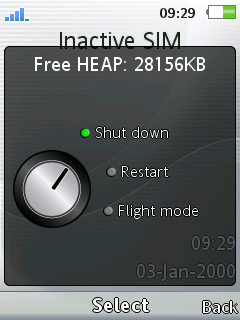
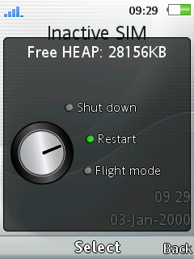
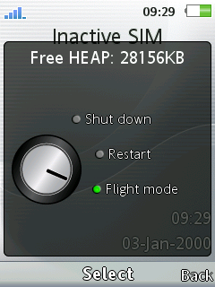

# Shutdown Menu DB3350
Add GUI Shutdown Menu when long press End Button on Standby.  
Added Free Heap on menu title.  

### Items:
* Shutdown
* Restart
* Flight mode

### Devices
- **J20 R7CA064**
- **J108 R7EA011**
- **U10 R1BA049**
- **U10 R7AA071**
- **U100 R7AA076**
- ...

### Patch Info
```
;Add GUI Shutdown Menu when long press End Button on Standby.
;Added Free Heap on menu title.
;New items: Shutdown,Restart,Flight mode.
;(c) farid
```

### Screenshot
 
 


## [Go Back](/readme.md)