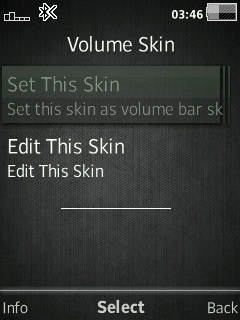
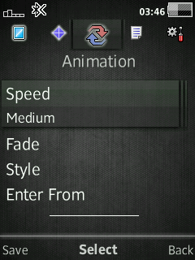
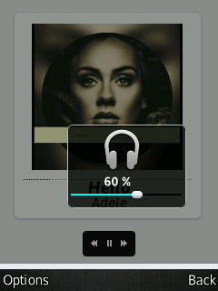

# Volume Redraw
Redraw volume control GUI with custom skin.  
Use `VolumeSkinEditor.elf` to edit skin.

## How to use
- set `.vsf` extension openwith to `VolumeSkinEditor.elf` using `extedit,elf`

## Devices
- **C510 R1HA035**
- **C903 R1GA028**
- **G502 R1FA037**
- **K600 R2BB001**
- **W350 R11CA002**
- **W508 R1FA035**
- **W810 R4EA031**
- **W910 R1FA037**
- **W980 R3EG004**
- **W995 R1HA035**
- ...

## Patch Info
```
;Ability to redraw VolumeControl with custom skin
;Use "VolumeSkinEditor.elf" to edit
;(c) blacklizard
;v1.5
```

## Screenshot
### C510 R1HA035




### W810 R4EA031


## [Go Back](../readme.md)